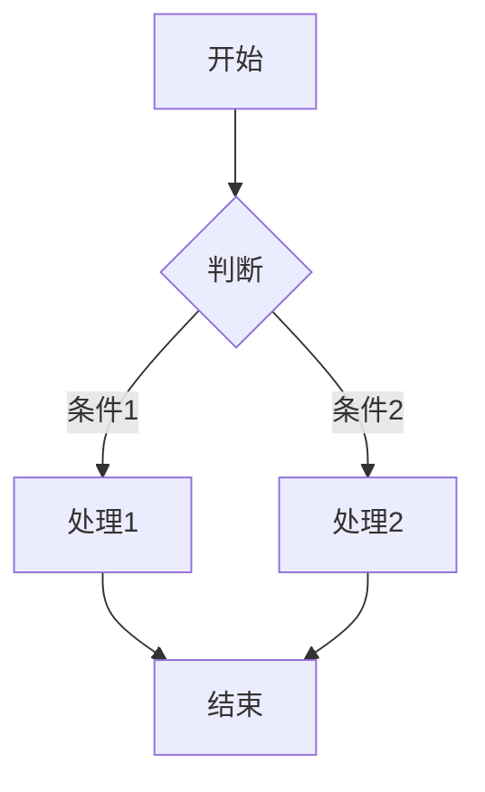
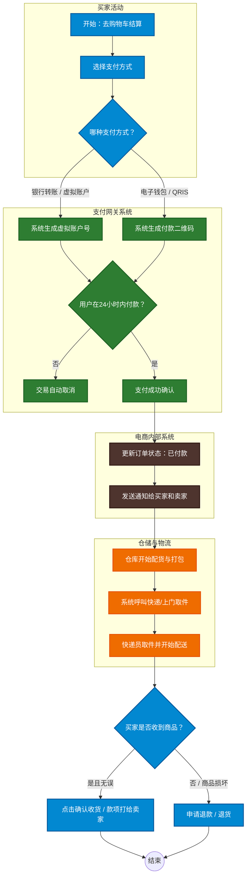

<link rel="stylesheet" href="./style.css">


# **我的 Markdown 密记 🤫**

Markdown 借助名类符号和语法来设置文本格式，做出你想要效果。它通常会被渲染为 HTML 格式，你也可以根据需求，将 Markdown 文件导出为 PDF 等其他格式。

制作 Markdown 文档，首先需要一些工具。为了更方便使用，我推荐使用 Visual Studio Code。下面是下载链接：[快点我!](https://code.visualstudio.com/)

  
## 标题  

在文字前面加上开好 `#`，即可设置为标题格式。  

|符号       |标题等级 |
|----------|---------|
|`#`       |一级标题  |
|`##`      |二级标题  |
|`###`     |三级标题  |
|`#####`   |四级标题  |
|`######`  |五级标题  |
|`#######` |六级标题  |  


## 段落

在 Markdown 中，段落是默认文本格式。直接输入内容，就会生成段落。想要分出多个段落，在内容之间空一行就行。如果只想在同一段里换行，在行末尾打上两个空格即可。


## 粗体 / 斜体  

用 `*` 或 `_` 包裹文字，就能设置格式。  
一般不建议使用下划线 `_`，在单词中间设置格式时，它可能无法生效。  

|符号       | 粗体 / 斜体      |
|----------|------------------|
|`* *`       |*斜体*           |
|`_ _ `      |_斜体_           |
|`** **`     |**粗体**         |
|`__ __`     |__粗体__         |
|`*** ***`   |***斜体 & 粗体***|
|`___ ___`   |___斜体 & 粗体___| 


## 高亮 / 删除线 

用两个 `~` 包裹文字，就能添加删除线。用两个 `=` 包裹文字，就能设置高亮。

>⚠️ 注意：   
>目前很多平台支持用 `==` 实现高亮， 但部分平台不兼容。例如 GitHub 不支持该写发 这时可以使用 HTML 标签 `<mark></mark>` 来实现高亮效果。

|符号 / 标签      |高亮 / 删除线     |
|----------------|------------------|
|`~~ ~~`         |~~删除线~~        |
|`<mark></mark>` |<mark>高亮</mark> |


## 上标 / 下标

用 `^` 包裹文字可设置上标，用 `~` 包裹文字可设置下标。

>⚠️ 注意.  
>这类符号在 Github 标准 Markdown中无法使用，可改用 HTML 标签实现。  
> 上标: `<sup></sup>`  
> 下标: `<sub></sub>`  

|符号 / 标签      |上标 / 下标             |
|----------------|------------------------|
|`<sup></sup>`   |X<sup>上标</sup>        |
|`<sub></sub>`   |X<sub>下标</sub>        |


## 行内代码

用来把文字显示代码格式，用单个反引号 `` ` `` 包裹内容即可。   
示例:  
`你好，我是行内代码`


## 代码块

用法和行内代码类似，区别是使用三个反引号 `` ` ``，也可以输入四个空格。   
示例：
```
大家好,
   我是代码块, 您可以使用我编写代码
``` 
代码块可以标准编程语言，还会自动区分代码颜色。
``` 
   ```js <- JavaScript / 程序语言
    // 这里编写代码
    ``` 
```
Javascript 代码示例：    
```js
   const a = 1
```
    

## 超链接

先用方括号 `[]` 放入显示文字，再用圆括号放入网址，就能创建，也支持相对链接

部分 Markdown 格式里，直接粘贴网址会自动转为链接，也可以使用`<>` 包裹网址生成链接。
|符号写法         |效果示例                         |
|----------------|------------------------------|
|`[文字](网址)`   |[Markdown Guide](https://www.markdownguide.org/)|
|`<网址>`        |<https://www.markdownguide.org/>|
|直接粘贴网址     |https://www.markdownguide.org/  |


## 图片

插入图片的格式和超链接基本一致，同样使用方括号和圆括号。区别是要在方括号前面加上 `!`。也可以使用 HTML 的  标签，它更加灵活，因为它可以让你控制图片的大小和样式。
示例
```
    
    或
    
```


## 引用文本

引用用来摘抄内容。在文字前加上 `>` 即可生成引用。叠加多个 `>`，还能实现嵌套引用。 characters.
> 哈喽， 这里是引用内容
>
>> 哈喽，这里是嵌套引用


# 分割线

在单独一行输入三个及以上 `-`、`_` 或 `*`，就能生成分割线。记得在文字和分割线之间空一行 

    示例

    ***
    ---
    ___

这是使用三个 `-` 的分割线

---

这是使用三个 `_` 的分割线

___

这是使用三个 `*` 的分割线 

***


## 列表

Markdown 包含两种列表：有序列表和无序列表。
无序列表：在每一项前添加 `-`、`*` 或 `+`。
有序列表：在每一项前加上数字和英文句号 `.`，数字顺序不影响最终显示效果。

符号或数字后面必须空一格。
还可以制作嵌套列表，用四个空格或制表键缩进即可。

使用 * 制作无序列表
* 无序列表项 1
* 无序列表项 2

使用 数字. 制作有序列表
1. 有序列表项 1
2. 有序列表项 2
3. 有序列表项 3  
   嵌套无序列表   
   （1） 嵌套项 x  
   （2） 嵌套项 y  
   （3） 嵌套项 y    
   
   嵌套有序列表  
   1. 嵌套项 1
   2. 嵌套项 2
   

## 表格

表格用法相对复杂。用 `|` 分隔不同列，每一行的开头和结尾都要加上 `|`。

表头下方需要添加分隔行，每一列至少写三个 `-`。搭配 `:` 可以设置文字对齐方式：

* 短横线左侧加 `:` → 左对齐

* 短横线右侧加 `:` → 右对齐

* 短横线两侧都加 `:` → 居中对齐

示例：
 1. 无对齐效果的表格
   
    | Col 1 | Col 2   |
    | ----- | ------- |
    | This  | is      |
    | an    | example |
    | table | with    |
    | two   | columns |

 2. 设置对齐效果的表格  
   
    | Right  | Center | Left |
    | -----: | :----: | :--- |
    | ---:   | :---:  | :--- |
    | R      | C      | L    |

>⚠️ 注意：  
>编写时表格不整齐也没关系。只要 `|` 和 `-` 的写法正确，渲染后就会自动规整对齐。


## 复选框

制作待办清单是，在每一项前方添加 `- [ ]` 或 `- [x]` 
- `- [ ]` 代表未勾选的复选框
- `- [x]` 代表已勾选的复选框
  
示例
- [ ] 未勾选 `- [ ]`
- [x] 已勾选 `- [x]`


## 图表

Markdown 支持使用 Mermaid 语法来直接绘制各种图表（如流程图、时序图、甘特图等），无需嵌套任何外部图片。

图表必须包裹在 \`\`\`mermaid 块中。第一行需要声明图表的**类型**和**方向**（例如 `graph TD` 表示由上至下的流程图）。

常用方向缩写：
* `TD` / `TB`：由上至下 (Top-Down / Top-Bottom)
* `LR`：由左至右 (Left-Right)
* `RL`：由右至左 (Right-Left)
* `BT`：由下至上 (Bottom-Top)

可以使用 `:::className` 语法来为图表中的特定节点绑定自定义样式（样式需提前使用 `classDef` 定义）。

示例：
 1. 基础流程图 (Flowchart TD)
    
    ```mermaid
    graph TD
        A[开始] --> B{判断}
        B -->|条件1| C[处理1]
        B -->|条件2| D[处理2]
        C --> E[结束]
        D --> E
    ```

 2. 带有子图和自定义样式的流程图 (Subgraph & Custom Styling)
    
    ```mermaid
    graph TD
        %% 1. 自定义样式定义
        classDef user fill:#0288d1,stroke:#01579b,stroke-width:2px,color:#ffffff;
        classDef system fill:#4e342e,stroke:#2d1510,stroke-width:2px,color:#ffffff;

        %% 2. 子图结构
        subgraph Pengguna [买家活动]
            A[开始：去购物车结算]:::user --> B[选择支付方式]:::user
        end

        subgraph Internal [电商内部系统]
            B --> C[更新订单状态]:::system
        end
    ```

>⚠️ 注意：  
>编写图表语法时，节点名称（如 A、B、C）后的括号类型决定了节点的形状。`[]` 表示矩形，`{}` 表示菱形（条件判断），`(())` 表示圆形。








# 特殊标题

可以使用符号也可以 HTML 代码。

HTML 代码示例：
```
<div style="background-color: #e8edfa; padding: 16px 20px; border-radius: 6px; font-family: sans-serif; margin-top: 15px; margin-bottom: 20px;">
    <span style="font-size: 1.1em;">🔗</span> <strong style="color: #1a1a1a; font-size: 1.1em;">配套服务</strong><span style="color: #4a4a4a; font-size: 0.95em;">/Supporting service</span>
</div>

<div style="background-color: #e8edfa; padding: 16px 20px; border-radius: 6px; font-family: sans-serif;">
    <strong style="color: #1a1a1a; font-size: 1.1em; font-weight: 900;">基础信息</strong><span style="color: #4a4a4a; font-size: 0.95em;"> / Basic information</span>
</div>
```
会显示
<div style="background-color: #e8edfa; padding: 16px 20px; border-radius: 6px; font-family: sans-serif; margin-top: 15px; margin-bottom: 20px;">
    <span style="font-size: 1.1em;">🔗</span> <strong style="color: #1a1a1a; font-size: 1.1em;">配套服务</strong><span style="color: #4a4a4a; font-size: 0.95em;">/Supporting service</span>
</div>

<div style="background-color: #e8edfa; padding: 16px 20px; border-radius: 6px; font-family: sans-serif;">
    <strong style="color: #1a1a1a; font-size: 1.1em; font-weight: 900;">基础信息</strong><span style="color: #4a4a4a; font-size: 0.95em;"> / Basic information</span>
</div>

符号示例：
```
### **基础信息** / Basic Information

### **基础信息** / <small>Basic information</small>

需要加 CSS 在代码项目里面。
例如：
文件名称：style.css
里面内容：
h3{
    background-color: #d7dff4;
    color:black;
    display: flex; 
    align-items: center; 
    padding: 10px 0px 6px 12px; 
    border-radius: 6px 6px 0px 0px;
    box-sizing: border-box;
}
在markdown文件里（就是 文件名.md）需要加上 
<link rel="stylesheet" href="./style.css">
```
会显示
### **基础信息** / Basic Information

### **基础信息** / <small>Basic information</small>